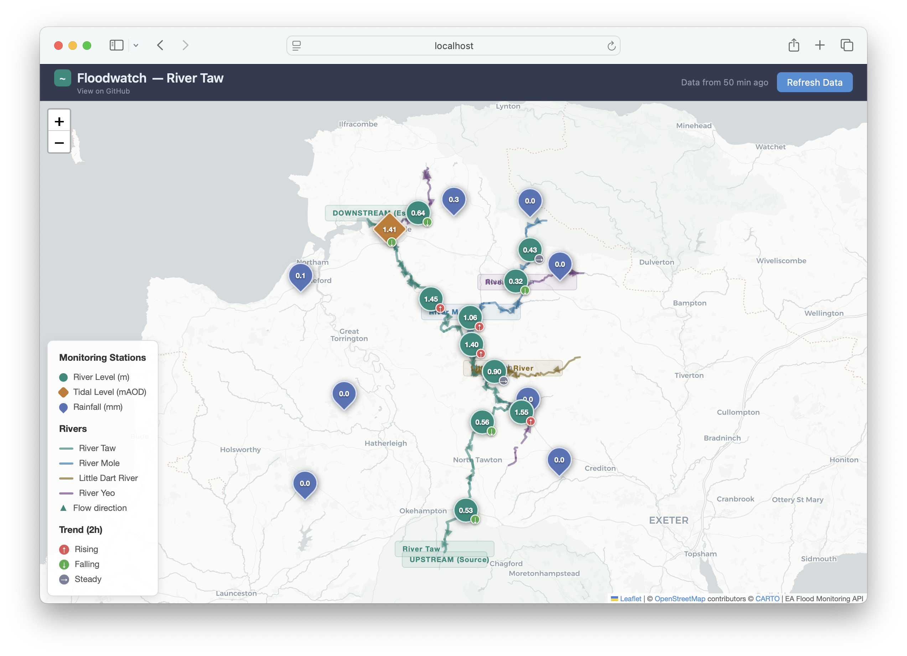

# Floodwatch — River Taw Catchment Monitoring



A real-time flood monitoring dashboard for the River Taw and its tributaries in Devon, UK. Displays river levels, tidal levels, and rainfall data from Environment Agency monitoring stations on an interactive map with flow visualisation and time-series charts.

## Quick Start

Fetch historical data (first time only — takes a few minutes):

```bash
python fetch_data.py            # Full history
python fetch_data.py --recent   # Quick update (merges last 2 days)
```

Start the local server:

```bash
python serve.py
```

Open in your browser:

```bash
open http://localhost:8080
```

## Usage

### `serve.py` — Local Development Server

Serves the static site and handles data refresh requests. No PHP, Node, or other runtime needed — just Python 3.

```bash
python serve.py              # Start on port 8080
python serve.py 3000         # Start on a custom port
python serve.py --stop       # Stop the running server
```

The server:

- Serves all static files (HTML, CSS, JS, CSV data, GeoJSON overlays)
- Handles `POST /refresh.php` by proxying to the EA Flood Monitoring API directly in Python
- Sets `Cache-Control: no-cache` headers on `.csv` and `.geojson` responses to prevent stale data
- Listens on IPv6 dual-stack (`::`) so both `localhost` (IPv6) and `127.0.0.1` (IPv4) work on macOS
- Tracks its own PID in `.server.pid` for clean start/stop lifecycle
- Auto-kills any stale server instance on the same port

Press `Ctrl+C` to stop, or use `python serve.py --stop` from another terminal.

### `fetch_data.py` — Data Fetcher

Downloads readings for all stations from the EA Flood Monitoring API and saves them as CSV files.

```bash
python fetch_data.py            # Full fetch — up to 2 years of history
python fetch_data.py --recent   # Quick update — last 2 days, merged with existing data
python fetch_data.py --recent 5 # Quick update — last 5 days
```

Run the full fetch once to seed the data directory, or again to backfill after a long gap. Use `--recent` for lightweight incremental updates — this is what the GitHub Actions workflow uses for hourly refreshes.

In `--recent` mode the script loads each station's existing CSV, fetches only the specified number of days from the API, merges and deduplicates by timestamp, and writes the combined result back. This keeps the full history intact while only making a handful of quick API calls.

This script:

- Fetches readings in 28-day chunks (full mode) or a single short request (`--recent` mode)
- Merges new readings with existing CSV data when using `--recent`
- Saves each station's data as a CSV in `data/`
- Writes `data/stations.csv` with metadata for all stations
- Deduplicates readings by timestamp
- Includes polite 300ms delays between API requests
- Stops fetching for a station after 3 consecutive empty chunks (full mode)

### `refresh.php` — LAMP Stack Backend (Optional)

If deploying to a LAMP server, this PHP script handles the same refresh logic as `serve.py`. The frontend's Refresh button POSTs to `/refresh.php` — whichever backend is available will respond.

## What the Map Shows

### Station Types

| Marker | Type | Unit | Colour | Shape |
|--------|------|------|--------|-------|
| River Level | Stage height | m | Teal | Circle |
| Tidal Level | Height above ordnance datum | mAOD | Amber | Diamond |
| Rainfall | Tipping bucket gauge total | mm | Blue | Teardrop |

Each marker displays the latest reading value. Click any marker to open a popup with:

- Current value and timestamp
- Trend indicator (for level and tidal stations — see below)
- Time-series chart with selectable ranges: **24h, 48h, 7d, 30d, All**
- "Top of normal range" reference line (dashed red) on level station charts
- Station name, type, and river

### High Water Level Warning

River level station markers turn **red** when the current reading exceeds 70% of the station's typical range high (the EA's 95th-percentile historical value). When the level drops back below the 70% threshold, the marker returns to its normal teal colour on the next data load or refresh.

Tidal and rainfall stations are not affected — their markers always use their standard colours.

### Chart Reference Line and Fixed Y-Axis

Level station popup charts display a dashed red horizontal line at the "top of normal range" (`typicalRangeHigh` from the EA API — the 95th percentile of historical readings). The Y-axis is fixed from **0** to **typicalRangeHigh × 1.5** so the scale stays consistent when switching between 24h, 48h, 7d, and 30d views.

Tidal and rainfall station charts start at 0 but auto-scale the Y-axis maximum since they don't have a meaningful typical range value.

### Trend Indicators

River level and tidal stations display a small coloured badge on the bottom-right corner of the marker showing whether the water level is rising, falling, or steady:

| Badge | Meaning | Colour |
|-------|---------|--------|
| ↑ | Rising | Red |
| ↓ | Falling | Green |
| → | Steady | Grey |

The trend is calculated by comparing the average reading over the last 2 hours with the average over the preceding 2 hours (2–4 hours ago). A change of more than ±1 cm (0.01 m) counts as rising or falling; anything within that threshold is steady.

The trend badge also appears in the popup next to the current value. Rainfall stations do not show a trend indicator.

If there isn't enough recent data (fewer than 2 readings in either time window), no badge is shown.

### River Overlays

Seven rivers are displayed as coloured GeoJSON overlays with flow direction arrows:

| River | Colour | Role |
|-------|--------|------|
| River Taw | Teal (#1a8a7d) | Main stem — source to estuary |
| River Mole | Blue (#2e7dab) | Tributary, joins near Newnham Bridge |
| Little Dart River | Brown (#8a6e1a) | Tributary, joins upstream of Newnham Bridge |
| River Yeo | Purple (#7a4a8a) | Tributary, joins near Barnstaple |
| Lapford Yeo | Burnt orange (#ab5e2e) | Tributary, joins the Taw near Lapford |
| Crooked Oak | Green (#5a8a3a) | Tributary, flows into the River Mole near South Molton |
| Hollocombe Water | Olive (#6a7a3a) | Tributary, joins the Taw between Eggesford and Kings Nympton |

Flow arrows (triangles) point downstream. The River Taw also has "UPSTREAM (Source)" and "DOWNSTREAM (Estuary)" labels. All rivers have a name label at their midpoint.

The GeoJSON data comes from OpenStreetMap via the Overpass API. OSM waterway ways are digitised in flow direction (source to mouth), so the arrows follow the natural direction of the data.

### Railway Overlays

Two railway lines are displayed as dashed grey overlays with station markers:

| Line | Route | Stations |
|------|-------|----------|
| Tarka Line | Exeter Central to Barnstaple | 14 stations (Exeter Central, Exeter St Davids, Newton St Cyres, Crediton, Yeoford, Copplestone, Morchard Road, Lapford, Eggesford, Kings Nympton, Portsmouth Arms, Umberleigh, Chapelton, Barnstaple) |
| Dartmoor Line | Coleford Junction to Okehampton | 1 station (Okehampton) — shared stations shown on the Tarka Line |

The Tarka and Dartmoor lines share track from Exeter to Coleford Junction (near Yeoford). Only the unique Dartmoor Line section from the junction to Okehampton is drawn separately to avoid duplication. Station markers show the station name on hover. Track data comes from OpenStreetMap (OSM relations 275887 and 276920).

### Map Tiles

Uses [CartoDB Positron](https://carto.com/basemaps/) — a light, muted basemap that keeps the focus on the data overlays.

### Mobile Responsiveness

The dashboard adapts to smaller screens with two CSS breakpoints:

| Breakpoint | Target | Key changes |
|------------|--------|-------------|
| ≤ 768px | Tablets | Compact header, smaller popups (320px), scrollable legend, compact chart height |
| ≤ 480px | Phones | Hidden subtitle, compact "last updated" text below refresh button, collapsible legend toggle (top-right), 280px popups, larger zoom controls, initial zoom level 10 |

On phones, the legend collapses to a single "Legend ▸" button in the top-right corner — tap to expand. The "last updated" timestamp is shown in a smaller font stacked below the Refresh button. The map starts at a wider zoom level to show all stations at a glance.

## Monitoring Stations

### River Taw (main stem, upstream to downstream)

| # | Station | ID | Lat/Lon |
|---|---------|-----|---------|
| 1 | Sticklepath | 50149 | 50.738, -3.918 |
| 2 | Taw Bridge | 50119 | 50.845, -3.886 |
| 3 | Newnham Bridge | 50132 | 50.940, -3.908 |
| 4 | Umberleigh | 50140 | 50.995, -3.985 |

### Barnstaple Tidal

| Station | ID | Lat/Lon | Unit |
|---------|-----|---------|------|
| Barnstaple (Tidal) | 50198 | 51.080, -4.065 | mAOD |

### River Mole (tributary, upstream to downstream)

| # | Station | ID | Lat/Lon |
|---|---------|-----|---------|
| 1 | North Molton | 50135 | 51.055, -3.795 |
| 2 | Mole Mills | 50153 | 51.017, -3.822 |
| 3 | Woodleigh | 50115 | 50.973, -3.910 |

### Little Dart River (tributary)

| Station | ID | Lat/Lon |
|---------|-----|---------|
| Chulmleigh | 50125 | 50.908, -3.864 |

### River Yeo (tributary, joins near Barnstaple)

| Station | ID | Lat/Lon |
|---------|-----|---------|
| Collard Bridge | 50114 | 51.100, -4.010 |

### Lapford Yeo (tributary, joins the Taw near Lapford)

| Station | ID | Lat/Lon |
|---------|-----|---------|
| Lapford | 50151 | 50.858, -3.811 |

### Crooked Oak (tributary, flows into the River Mole)

No monitoring stations on this river.

### Hollocombe Water (tributary, joins the Taw between Eggesford and Kings Nympton)

No monitoring stations on this river.

### Rainfall Stations

**East of the Taw:**

| Station | ID | Lat/Lon |
|---------|-----|---------|
| Lapford Bowerthy | 50199 | 50.873, -3.799 |
| Molland Sindercombe | E85220 | 51.038, -3.736 |
| Crediton Knowle | E84360 | 50.800, -3.738 |
| Kinsford Gate | 45183 | 51.114, -3.795 |

**West of the Taw:**

| Station | ID | Lat/Lon |
|---------|-----|---------|
| Allisland | 50103 | 50.881, -4.153 |
| Kenwith Castle | 50194 | 51.024, -4.236 |
| Bratton Fleming Haxton | E82120 | 51.117, -3.941 |
| Halwill | 47158 | 50.772, -4.229 |

## Data Source

All hydrological data comes from the **Environment Agency Flood Monitoring API**:

```
https://environment.data.gov.uk/flood-monitoring
```

This is the same data that powers the government's [Check for Flooding](https://check-for-flooding.service.gov.uk/) service. Readings are taken every 15 minutes.

### Measure ID Format

Each station has a unique measure identifier that encodes the station, parameter, qualifier, interval, and unit:

```
{stationId}-{parameter}-{qualifier}-{type}-{interval}-{unit}
```

Examples:
- `50132-level-stage-i-15_min-m` — Newnham Bridge river level (instantaneous, metres)
- `50198-level-tidal_level-i-15_min-mAOD` — Barnstaple tidal level (metres above ordnance datum)
- `50199-rainfall-tipping_bucket_raingauge-t-15_min-mm` — Lapford Bowerthy rainfall (total, mm)

### API Endpoints Used

| Purpose | Endpoint |
|---------|----------|
| Recent readings | `GET /id/measures/{measureId}/readings?since={ISO8601}&_sorted&_limit=10000` |
| Date range | `GET /id/measures/{measureId}/readings?startdate={YYYY-MM-DD}&enddate={YYYY-MM-DD}&_sorted&_limit=100000` |
| Station lookup | `GET /id/stations?RLOIid={id}` |

### Refresh Logic

When you click **Refresh Data**, the app determines the gap between the last known reading and now for each station:

- **Gap ≤ 5 days:** Single API request using `?since=` — fast and efficient
- **Gap > 5 days:** Fetches in 28-day chunks working backwards to the last known timestamp — fills the entire gap without missing data
- **No existing data:** Fetches the last 28 days as a starting point

This gap-fill logic applies identically across the frontend (JavaScript), `serve.py` (Python), and `refresh.php` (PHP).

#### Activity Log

An activity log appears in the bottom-right corner of the map during refresh, showing:

- A progress bar (e.g. "7/19 stations")
- Per-station status: fetching, success with reading count, errors, and warnings for large gaps
- A summary line on completion

The log fades away a few seconds after the refresh completes.

#### Backend Detection and Caching

On page load, the app probes for a backend by sending an `OPTIONS` request to `/refresh`. If the response includes `Access-Control-Allow-Methods: POST`, a backend is present (LAMP or serve.py). Otherwise the app assumes it's running as a static site.

| Deployment | After fetching from EA API |
|------------|---------------------------|
| **LAMP / serve.py** | Caches to `localStorage`, then POSTs to backend to persist updated CSVs server-side |
| **Static (App Platform, etc.)** | Caches the last 7 days of readings in `localStorage` so they survive page reloads |

All deployments cache refreshed data to `localStorage` — this means a page reload always shows the most recent data you've fetched, even if the browser's HTTP cache serves stale CSV files. On LAMP/serve.py, the backend sync happens after the local cache, so data is persisted in both places.

On page load, any cached readings from `localStorage` are merged on top of the CSV data, so the map immediately reflects the most recent data — even before hitting Refresh. CSV requests include a cache-busting parameter to bypass browser HTTP caching.

After a refresh, station markers are re-created with updated values and trend badges.

## Data Files

All data lives in the `data/` directory:

```
data/
  stations.csv                          # Station metadata (all 19 stations)
  level_50149_sticklepath.csv           # River level CSVs (11 files)
  level_50119_taw_bridge.csv
  level_50132_newnham_bridge.csv
  level_50140_umberleigh.csv
  level_50198_barnstaple_(tidal).csv
  level_50135_north_molton.csv
  level_50153_mole_mills.csv
  level_50115_woodleigh.csv
  level_50125_chulmleigh.csv
  level_50151_lapford.csv
  level_50114_collard_bridge.csv
  rainfall_50199.csv                    # Rainfall CSVs (8 files)
  rainfall_E85220.csv
  rainfall_E84360.csv
  rainfall_45183.csv
  rainfall_50103.csv
  rainfall_50194.csv
  rainfall_E82120.csv
  rainfall_47158.csv
  river_taw.geojson                     # River geometry (7 files)
  river_mole.geojson
  river_little_dart.geojson
  river_yeo.geojson
  river_lapford_yeo.geojson
  river_crooked_oak.geojson
  river_hollacombe_water.geojson
  tarka_line.geojson                    # Railway track geometry (2 files)
  dartmoor_line.geojson
  tarka_stations.geojson                # Railway station points (2 files)
  dartmoor_stations.geojson
```

### CSV Format

All station CSVs share the same structure:

```csv
dateTime,value,unit,station_id,station_label
2026-02-10T10:15:00Z,0.523,m,50149,Sticklepath
2026-02-10T10:30:00Z,0.521,m,50149,Sticklepath
```

| Column | Description |
|--------|-------------|
| `dateTime` | ISO 8601 timestamp in UTC |
| `value` | Reading value (float) |
| `unit` | `m`, `mAOD`, or `mm` |
| `station_id` | EA station reference |
| `station_label` | Human-readable name |

## Deployment

### Local (recommended for development)

```bash
python serve.py
```

No dependencies beyond Python 3 standard library (for the server). `fetch_data.py` also only uses the standard library.

The frontend loads Leaflet, Chart.js, and PapaParse from CDNs.

### Digital Ocean (LAMP Droplet)

This walks through deploying Floodwatch to a Digital Ocean droplet running Apache and PHP. A $6/mo Regular droplet is more than enough.

#### 1. Create the Droplet

- Log in to [cloud.digitalocean.com](https://cloud.digitalocean.com/)
- **Create** > **Droplets**
- **Marketplace** tab > search **LAMP** > select **LAMP on Ubuntu**
- Choose **Regular (Disk type: SSD)** > **$6/mo** (1 GB / 1 CPU)
- Pick a region (London is closest to Devon)
- **Authentication**: SSH key (recommended) or password
- Click **Create Droplet**

Note the droplet's IP address once it's created.

#### 2. SSH In and Configure

```bash
ssh root@YOUR_DROPLET_IP
```

On first login the LAMP image may prompt you to set a MySQL password — you can skip this (we don't need a database).

Verify Apache and PHP are running:

```bash
systemctl status apache2
php -v
```

Ensure PHP can make outbound HTTP requests (required for the refresh endpoint):

```bash
php -r "echo ini_get('allow_url_fopen');"
```

This should print `1`.

If it prints empty or `0`, enable it:

```bash
sed -i 's/allow_url_fopen = Off/allow_url_fopen = On/' /etc/php/*/apache2/php.ini
systemctl restart apache2
```

#### 3. Deploy the Files

**Option A: From your local machine using rsync**

```bash
rsync -avz --exclude='.server.pid' --exclude='__pycache__' --exclude='.DS_Store' \
  ./ root@YOUR_DROPLET_IP:/var/www/html/floodwatch/
```

**Option B: From your local machine using scp**

```bash
scp -r ./ root@YOUR_DROPLET_IP:/var/www/html/floodwatch/
```

**Option C: Clone from a git repo on the server**

```bash
cd /var/www/html
git clone https://your-repo-url.git floodwatch
```

#### 4. Set Permissions

Apache runs as `www-data` and needs to write to the `data/` directory when the Refresh button is clicked:

```bash
chown -R www-data:www-data /var/www/html/floodwatch/data/
chmod -R 775 /var/www/html/floodwatch/data/
```

The rest of the site is static and only needs read access:

```bash
chown root:root /var/www/html/floodwatch/index.html
chown root:root /var/www/html/floodwatch/refresh.php
```

#### 5. Seed the Historical Data

If you didn't rsync the `data/` directory with populated CSVs, run the fetcher on the server:

```bash
cd /var/www/html/floodwatch
python3 fetch_data.py
chown -R www-data:www-data data/
```

This downloads up to 2 years of historical data. Takes a few minutes.

#### 6. Test It

Open your browser and visit:

```
http://YOUR_DROPLET_IP/floodwatch/
```

You should see the map with stations. Click **Refresh Data** — the activity log should show each station being fetched, and the backend sync should succeed.

Test the refresh endpoint directly:

```bash
curl -X POST http://YOUR_DROPLET_IP/floodwatch/refresh.php
```

Should return JSON with `"success": true` and per-station details.

#### 7. Set Up a Custom Domain (Optional)

Point your domain's DNS A record to the droplet IP, then:

```bash
apt install certbot python3-certbot-apache -y
certbot --apache -d yourdomain.com
```

This installs a free Let's Encrypt SSL certificate and configures Apache for HTTPS.

If you want the site at the root of the domain rather than `/floodwatch/`:

```bash
mv /var/www/html/floodwatch/* /var/www/html/
```

Or create an Apache VirtualHost:

```bash
cat > /etc/apache2/sites-available/floodwatch.conf << 'EOF'
<VirtualHost *:80>
    ServerName yourdomain.com
    DocumentRoot /var/www/html/floodwatch

    <Directory /var/www/html/floodwatch>
        AllowOverride None
        Require all granted
    </Directory>

    <Directory /var/www/html/floodwatch/data>
        Options -Indexes
    </Directory>
</VirtualHost>
EOF

a2ensite floodwatch.conf
a2dissite 000-default.conf
systemctl reload apache2
certbot --apache -d yourdomain.com
```

#### 8. Set Up Automatic Data Refresh (Optional)

Rather than relying on someone clicking the Refresh button, set up a cron job to keep data fresh:

```bash
crontab -e
```

Add this line to refresh every 15 minutes (matching the EA's measurement interval):

```cron
*/15 * * * * curl -s -X POST http://localhost/floodwatch/refresh.php > /dev/null 2>&1
```

Or if you want to use the Python fetcher for a more thorough periodic sync:

```cron
0 * * * * cd /var/www/html/floodwatch && python3 fetch_data.py --recent > /dev/null 2>&1 && chown -R www-data:www-data data/
```

#### 9. Updating the Site

To push changes after local development:

```bash
rsync -avz --exclude='.server.pid' --exclude='__pycache__' --exclude='.DS_Store' --exclude='data/' \
  ./ root@YOUR_DROPLET_IP:/var/www/html/floodwatch/
```

The `--exclude='data/'` flag avoids overwriting the server's live data with your local copy.

#### Security Hardening (Recommended)

Disable directory listing on the data folder so people can't browse your CSVs:

```bash
cat > /var/www/html/floodwatch/data/.htaccess << 'EOF'
Options -Indexes
EOF
```

Set up the firewall:

```bash
ufw allow OpenSSH
ufw allow 'Apache Full'
ufw enable
```

Enable automatic security updates:

```bash
apt install unattended-upgrades -y
dpkg-reconfigure -plow unattended-upgrades
```

#### Costs

| Resource | Cost |
|----------|------|
| Droplet (Regular, 1GB) | $6/mo |
| Domain (optional) | ~$10/yr |
| SSL (Let's Encrypt) | Free |
| EA Flood Monitoring API | Free |
| **Total** | **$6/mo** |

### Digital Ocean App Platform (Recommended)

The simplest deployment option. App Platform serves the static site directly — no server management, no SSH, automatic SSL. The Refresh button works entirely client-side (fetching directly from the EA API in the browser), so no backend service is needed.

#### 1. Push to GitHub

Create a repo and push your code including the data files.

Seed the data if you haven't already:

```bash
cd /path/to/floodwatch
python fetch_data.py
```

Initialise the repo and push:

```bash
git init
git add .
git commit -m "Initial commit with seeded data"
git remote add origin git@github.com:YOUR_USERNAME/floodwatch.git
git push -u origin main
```

The CSV data files and GeoJSON overlays are committed to the repo — they're small (~2 MB total) and this means the site works immediately on deploy with full historical data.

#### 2. Create the App

**Option A: Via the Dashboard**

- Go to [cloud.digitalocean.com/apps](https://cloud.digitalocean.com/apps)
- Click **Create App**
- Select **GitHub** as the source, authorise access, pick your `floodwatch` repo
- App Platform auto-detects it as a **Static Site** (because of `index.html`)
- Set the region to **London** (closest to Devon)
- Click **Create Resources**

**Option B: Via the CLI**

Install [doctl](https://docs.digitalocean.com/reference/doctl/how-to/install/) and authenticate, then:

```bash
doctl apps create --spec .do/app.yaml
```

#### 3. You're Done

App Platform gives you a URL like `https://floodwatch-xxxxx.ondigitalocean.app`. The site is live with:

- Automatic HTTPS/SSL
- Global CDN
- Auto-deploy on every `git push` to `main`

#### Adding a Custom Domain

In the App Platform dashboard:

- Go to your app > **Settings** > **Domains**
- Click **Add Domain**, enter your domain name
- Add the CNAME record it gives you to your DNS provider
- SSL is provisioned automatically

#### Data Transfer Estimate

Each page load serves the HTML, 19 CSV data files, 7 GeoJSON river overlays, and 4 railway GeoJSON files (2 track + 2 station). CDN libraries (Leaflet, Chart.js, PapaParse) are loaded from external CDNs and don't count towards App Platform transfer.

| Asset | Raw size | Gzipped (approx) |
|-------|----------|-------------------|
| `index.html` | 65 KB | ~15 KB |
| 19 CSV files | 2.7 MB | ~500 KB |
| 7 river GeoJSON files | 245 KB | ~65 KB |
| 4 railway GeoJSON files | 80 KB | ~20 KB |
| **Total per visit** | **~3.1 MB** | **~600 KB** |

App Platform serves static files with gzip compression, so actual transfer is roughly 600 KB per visit. CSV requests include a cache-busting query parameter (`?t=...`) to ensure the browser always fetches fresh data, which means the CDN may not cache CSVs between visits — but at ~500 KB this has negligible impact on transfer.

**Free tier: 1 GiB/month outbound transfer.** That allows approximately **1,700 page loads/month** — around 55 visits/day. For a personal or small-team dashboard this is plenty. If you share the link more widely and exceed the limit, upgrading to a $3/mo static site plan removes the cap.

The hourly GitHub Actions deploys trigger rebuilds on App Platform, but build traffic is internal and not counted as outbound transfer.

#### Costs

| Resource | Cost |
|----------|------|
| App Platform (Static Site) | **Free** (up to 3 apps, 1 GiB outbound/mo, ~1,800 visits) |
| Custom domain | ~$10/yr |
| SSL | Free (automatic) |
| GitHub Actions | Free (2,000 mins/mo on free tier, ~1,500 used) |
| EA Flood Monitoring API | Free |
| **Total** | **$0/mo** |

If you exceed the free tier's 1 GiB/month transfer or need more than 3 apps, static site plans start at $3/mo.

### Generic LAMP Stack

If you're deploying to an existing LAMP server rather than a fresh Digital Ocean droplet, the key steps are:

1. Upload all files to your web root
2. Ensure `data/` is writable by the web server user (`www-data`, `apache`, or `nginx`)
3. Ensure PHP has `allow_url_fopen = On`
4. Optionally run `python3 fetch_data.py` to seed historical data
5. Optionally set up a cron job to call `refresh.php` periodically

## Keeping Data Fresh

The app automatically detects whether it's running on a backend (LAMP/serve.py) or as a static site (App Platform) and adapts the Refresh button accordingly:

| Deployment | Refresh behaviour |
|------------|-------------------|
| **LAMP / serve.py** | Fetches from EA API client-side, caches to `localStorage`, then POSTs to backend to persist updated CSVs server-side |
| **App Platform (static)** | Fetches from EA API client-side, then caches the last 7 days of refreshed data in `localStorage` so it survives page reloads |

On all deployments, refreshed data is cached to `localStorage` first, so a page reload always shows the latest data you've fetched — even if the browser's HTTP cache serves an older CSV. On App Platform, the initial page load serves the committed CSV data, then merges any cached readings on top.

To keep the committed CSV baseline fresh, the included GitHub Actions workflow runs `fetch_data.py --recent` every hour, commits any new data, and pushes — triggering an automatic redeploy. You can also update manually:

```bash
cd /path/to/floodwatch
python fetch_data.py --recent   # Quick: merge last 2 days
git add data/
git commit -m "Update station data"
git push
```

App Platform auto-deploys on push, so the site will serve the updated CSVs within a minute or two.

### Automating with GitHub Actions

The workflow file `.github/workflows/update-data.yml` updates the CSVs on a schedule:

```yaml
name: Update Station Data

on:
  schedule:
    - cron: '30 * * * *'   # Every hour at :30 past
  workflow_dispatch:        # Manual trigger from Actions tab

jobs:
  update-data:
    runs-on: ubuntu-latest
    permissions:
      contents: write

    steps:
      - name: Checkout repository
        uses: actions/checkout@v4

      - name: Set up Python
        uses: actions/setup-python@v5
        with:
          python-version: '3.12'

      - name: Fetch recent data
        run: python fetch_data.py --recent

      - name: Commit and push if changed
        run: |
          git config user.name "github-actions[bot]"
          git config user.email "github-actions[bot]@users.noreply.github.com"
          git add data/
          if git diff --staged --quiet; then
            echo "No data changes to commit"
          else
            git commit -m "Update station data $(date -u +'%Y-%m-%d %H:%M') UTC"
            git push
          fi
```

This runs at 30 minutes past every hour. EA stations report every 15 minutes but the data takes ~20 minutes to appear on the API, so running at :30 reliably captures each hour's :00 reading. The `--recent` flag fetches only the last 2 days of data and merges it with the existing CSVs, so each run is fast (~30 seconds for all 19 stations) and only commits if data actually changed. Each push triggers an automatic redeploy on App Platform.

You can also trigger the workflow manually from the **Actions** tab in your GitHub repo.

**Free tier fit:** Each `--recent` run typically completes in under 1 minute. At 24 runs/day × 31 days × ~1 minute ≈ **744 minutes/month**, well within the 2,000-minute free tier allowance.

## Project Structure

```
floodwatch/
  index.html                          # Single-page app (HTML + inline CSS + JS)
  fetch_data.py                       # Data fetcher (full or --recent incremental)
  serve.py                            # Local Python dev server with refresh proxy
  refresh.php                         # PHP refresh endpoint for LAMP deployment
  README.md                           # This file
  LICENSE                             # MIT licence
  .gitignore                          # Excludes .server.pid, __pycache__, .DS_Store
  .do/app.yaml                        # Digital Ocean App Platform spec
  .github/workflows/update-data.yml   # Hourly GitHub Actions data refresh
  images/                             # Static images
    screenshot.png                    # README screenshot
    opengraph.png                     # Social media preview (1200×630)
  data/                               # CSV data files and GeoJSON river overlays
  .server.pid                         # Auto-managed server PID file (gitignored)
```

## Technology

| Component | Technology |
|-----------|-----------|
| Map | [Leaflet.js](https://leafletjs.com/) 1.9.4 |
| Basemap tiles | [CartoDB Positron](https://carto.com/basemaps/) |
| Charts | [Chart.js](https://www.chartjs.org/) 4.4.1 with date-fns adapter |
| CSV parsing | [PapaParse](https://www.papaparse.com/) 5.4.1 |
| River geometry | [OpenStreetMap](https://www.openstreetmap.org/) via [Overpass API](https://overpass-api.de/) |
| Data source | [EA Flood Monitoring API](https://environment.data.gov.uk/flood-monitoring/doc/reference) |
| Dev server | Python 3 standard library (`http.server`) |
| Production backend | PHP (`refresh.php`) |

## Licence

The code in this repository is licensed under the MIT licence.

Copyright &copy; 2026 Alasdair Allan

Permission is hereby granted, free of charge, to any person obtaining a copy of this software and associated documentation files (the "Software"), to deal in the Software without restriction, including without limitation the rights to use, copy, modify, merge, publish, distribute, sublicense, and/or sell copies of the Software, and to permit persons to whom the Software is furnished to do so, subject to the following conditions:

The above copyright notice and this permission notice shall be included in all copies or substantial portions of the Software.

THE SOFTWARE IS PROVIDED "AS IS", WITHOUT WARRANTY OF ANY KIND, EXPRESS OR IMPLIED, INCLUDING BUT NOT LIMITED TO THE WARRANTIES OF MERCHANTABILITY, FITNESS FOR A PARTICULAR PURPOSE AND NONINFRINGEMENT. IN NO EVENT SHALL THE AUTHORS OR COPYRIGHT HOLDERS BE LIABLE FOR ANY CLAIM, DAMAGES OR OTHER LIABILITY, WHETHER IN AN ACTION OF CONTRACT, TORT OR OTHERWISE, ARISING FROM, OUT OF OR IN CONNECTION WITH THE SOFTWARE OR THE USE OR OTHER DEALINGS IN THE SOFTWARE.
